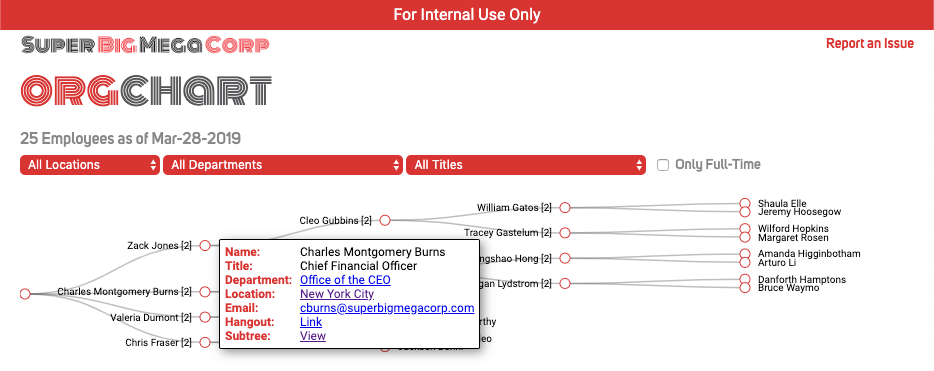

# OpenTree: Generate an Org Chart from Workday




## Purpose
tl;dr Generate and render your company's org chart based on Workday data (or any flat, row-based dataset which uses identifiers to link child nodes to single parents).

Individuals who use [Workday](https://workday.com) can view the supervisory org that they manage or that they're part of, and can otherwise navigate stepwise up and down the org, but there is no built-in capability within Workday to view a company-wide, comprehensive org chart. Visibility into an organization's overall structure is a valuable resource for employees across a company. This project uses Workday data and generates a hierarchical org chart rendered on a web page.

The application provides filtering options to view subtrees and filter by location, department (cost center), and title.

## Prerequisites
### Running Locally
* Java 9+
* Maven
* MariaDB 10.3

### Running in Docker
* Docker

## Run With Sample Data
To run on your local machine, you'll have to have MariaDB 10.3 installed, the [schema](src/main/resources/schema.sql) created, and username/password set (these must match the `spring.datasource.username` and `spring.datasource.password` fields in [`application.properties`](src/main/resources/application.properties)).
```shell
%> mysql -u opentree -p opentree < schema.sql  # assumes username 'opentree' and data load into a schema called 'opentree'
%> mysql.server start  # the command to start the database will vary depending on your platform
%> git clone https://github.com/shutterstock/opentree.git
%> cd opentree
%> mvn package
%> mvn spring-boot:run
```

Running the application in Docker is totally self-contained, so outside of having Docker installed, no additional setup is required:
```shell
%> docker build . -t opentree
%> docker run -p 8080:8080 opentree
```

In both cases, once startup is complete, browse to [`http://localhost:8080`](http://localhost:8080) to view the application.

## Architecture
This application is based on Spring Boot (MVC) and follows a standard 3-tier architecture.

The backend uses a MariaDB relational database running on `localhost`. This can be configured in [`application.properties`](src/main/resources/application.properties). If running in Docker, you'll need to update the [`Dockerfile`](Dockerfile) to correctly reflect database location and user information.

The middle-tier is Spring and governed through [models](src/main/java/com/shutterstock/oss/opentree/model/entity) and [controllers](src/main/java/com/shutterstock/oss/opentree/web/controller).

The views use the [Thymeleaf templating engine](https://www.thymeleaf.org/) and [d3.js](https://d3js.org).

## Setup
A custom report endpoint must be setup in Workday to generate a CSV report with the desired fields you wish to render on the front-end. By default, the following fields are used and displayed in the front-end:
* `EmployeeID`: used as the unique identifier for a given employee. This field *must* be unique for the tree to link nodes and build correctly. Matrix reporting (where an Employee has multiple records in the CSV report, each with a distinct `MmanagerID`) is not supported
* `Name`: full name of the employee
* `ManagerID`: the `EmployeeID` of the employee's manager 
* `ManagerName`: full name of the manager
* `Location`: work location
* `Title`: official title
* `WorkEmail`: work email
* `Type`: typically `Employee` or `Contingent`; this is used to filter out non-FT employees from the main view
* `CostCenter`: this is likely
* `CostCenterHierarchy`

Fields can be configured in the [`Employee` model](src/main/java/com/shutterstock/oss/opentree/model/entity/Employee.java). For a given field in the CSV which is to be available on the front-end, the CSV column headers for those fields *MUST* be mapped to the model. [opencsv](http://opencsv.sourceforge.net/) is used to automatically map CSV fields to `Employee` fields via annotations (`@CsvBindByName`).

Though employee images in Workday can be exposed in reports as base64-encoded strings, as of this time, cropped thumbnails are not. As a result, this application does not display employee images of any kind.

The dummy [CSV data set](src/main/resources/employees.csv) provides an example for the structure of the Workday report required to generate a hierarchical tree.

Once the report endpoint and authorized credentials have been created, update the Workday configuration attributes in [`application.properties`](src/main/resources/application.properties), specifically the following:
* `wd.endpoint`: full URL of the report endpoint
* `wd.username`: username of authorized account
* `wd.password`: password of authorized username account

## Customizing OpenTree
If you want to customize the application with your company's brand, start here:
* company details in [`application.properties`](src/main/resources/application.properties)
  * `opentree.company.name`: set your company's name
  * `opentree.email.domain`: set your company's email domain, e.g. superbigmegacorp.com
  * `opentree.web.fonts`: choose alternative Google fonts for rendering display/body text; you'll need to update CSS files to reference alternative font types specified here
  * `opentree.report-issue-url`: set the URL for submitting Github issues
* logo: replace [`logo.png`](src/main/resources/static/img/logo.png) with your brand's logo
* favicons: create favicons and save them in the [`resources/static/img/`](src/main/resources/static/img) directory and reference those files in [`head.html`](src/main/resources/templates/fragments/head.html)

## Running in Production
A Workday endpoint that generates and returns a CSV report with the appropriate data must be set up before you can enable `opentree.production` mode (at which point the application will begin calling the configured Workday endpoint).

Authentication credentials for Workday (`wd.username` and `wd.password`) and the database (`spring.datasource.username` and `spring.datasource.password`) should be externalized into a secure store like [Vault](https://github.com/hashicorp/vault). Implementation of this is outside the scope of this project.

The default logging configuration is set to `debug`&mash;in production, you will likely want to decrease the logging level for less verbosity. Update the `level` for the `com.shutterstock.oss.opentree` `Logger` in [`log4j2.xml`](/src/main/resources/log4j2.xml).

## Administrative Functions
Several URL mappings exist to provide light, administrative functionality, managed by the [`AdminController`](src/main/java/com/shutterstock/oss/opentree/web/controller/AdminController.java):
* `/admin/refresh`: the default TTL for the cache is 24 hours (defined in `application.properties` as `opentree.cache.ttl-hours`), so hitting this route will force a new fetch of data from Workday
* `/admin/updates`: (view: [`updates.html`](src/main/resources/templates/updates.html)) this will display employee data updates (since the database was first created and populated)
* `/admin/dumpdb`:  (view: [`dump.html`](src/main/resources/templates/dump.html)) this will dump the raw contents of the database in an HTML table in CSV format
* `/admin/dumpcache`: this will dump the contents of the cache as a hierarchical JSON document
* `/admin/morgue`: (view: [`morgue.html`](src/main/resources/templates/morgue.html)) this will display a list of all employees who are no longer with the company (since the database was first created and populated)

As state is managed by the database, any drops or restarts in the Docker container will result in loss of historical state (e.g. updates, attrition). This will happen be default if the database pre-configured with the Docker image is not replaced with an externalized database and each time it is run. However, this has no impact on the ability to display the current org chart.

## License
[](https://opensource.org/licenses/MIT)